<p align="center">
  
</p>

<p align="center">
  <a href="https://www.linkedin.com/in/aman-kumar018/"></a>
  <a href="mailto:amanohc1@gmail.com"></a>
  <a href="https://instagram.com/itz.aman_018"></a>
  
</p>


## About

I build things that sit at the intersection of **machine learning** and **usable software** — models that ship inside real interfaces, not just notebooks.

```
Focus      ML / Deep Learning · Full-stack web · Cloud
Learning   Computer vision, model deployment, system design
Ask me     Python · ML pipelines · React · Node · MySQL
Reach me   amanohc1@gmail.com
```

Open to collaboration on ML, web, or anything worth building.


## Toolbox

<p align="center">
  
</p>

| | |
|:--|:--|
| **Languages** |      |
| **ML / Data** |        |
| **Web** |      |
| **Data stores** |    |
| **Cloud / Ops** |      |


## Work

<p align="center">
  
</p>

<p align="center">
  <a href="https://github.com/Aman001-vk/Codestorm">Codestorm</a> ·
  <a href="https://github.com/Aman001-vk/Jarvis">Jarvis</a> ·
  <a href="https://github.com/Aman001-vk/FUTURE_ML_01">FUTURE_ML_01</a> ·
  <a href="https://github.com/Aman001-vk/FUTURE_ML_02">FUTURE_ML_02</a> ·
  <a href="https://github.com/Aman001-vk/FUTURE_ML_03">FUTURE_ML_03</a> ·
  <a href="https://github.com/Aman001-vk?tab=repositories">all repos →</a>
</p>


## Activity

<p align="center">
  
  
</p>

<p align="center">
  
</p>

<p align="center">
  
</p>


## Connect

<p align="center">
  
</p>
